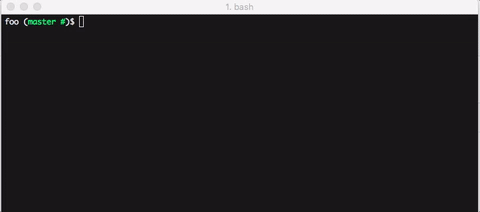

# flashcards
A command line flashcard thing for learning things


## Installation
`npm install -g flashcards`

## Usage
See the various commands:
```
flashcards
```

Practice a deck of cards:
```
flashcards practice --deck <deck-name>
```

See your progress:
```
flashcards inspect --deck <deck-name>
```

NOTE: So far the only deck of cards available is `spanish-vocabulary`

### Practice flashcards before running `git`:
```bash
# your ~/.bashrc or ~/.bash_profile
alias flash="flashcards practice --deck spanish-vocabulary; git $@"
```
Then instead of using `git` use `flash` instead:


TODO:
- document creating new decks and installing them
- document learning algorithm
